# FXPAN

Two Nikon D800 bodies behind one Nikkor-W 180 mm f/5.6. A 50 × 75 mm
beamsplitter sends each body half of the field. The stitch is

**64.80 × 23.9 mm · 2.711:1 · 13248 × 4912 · 65.1 MP**

XPan is 65 × 24 mm at 2.708:1. It is shot from f/5.6 to f/22. The
Nikkor-W covers the stitch wide open. The 44 mm mouths fully clear the
extreme corners from f/8.4; at f/5.6 those corners still pass most of the
light, and the long axis stays clean. The iPhone is the viewfinder and the
stitcher. A
Pi Zero on the lid pulses both 10-pin remotes together.

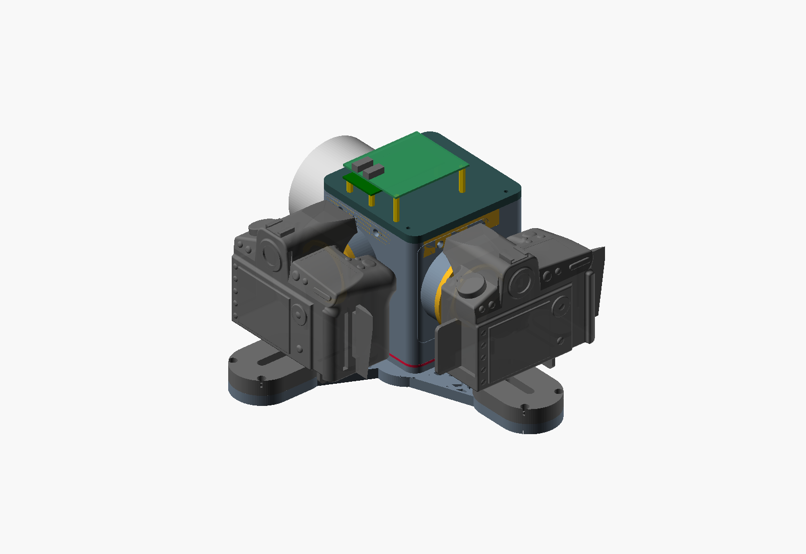

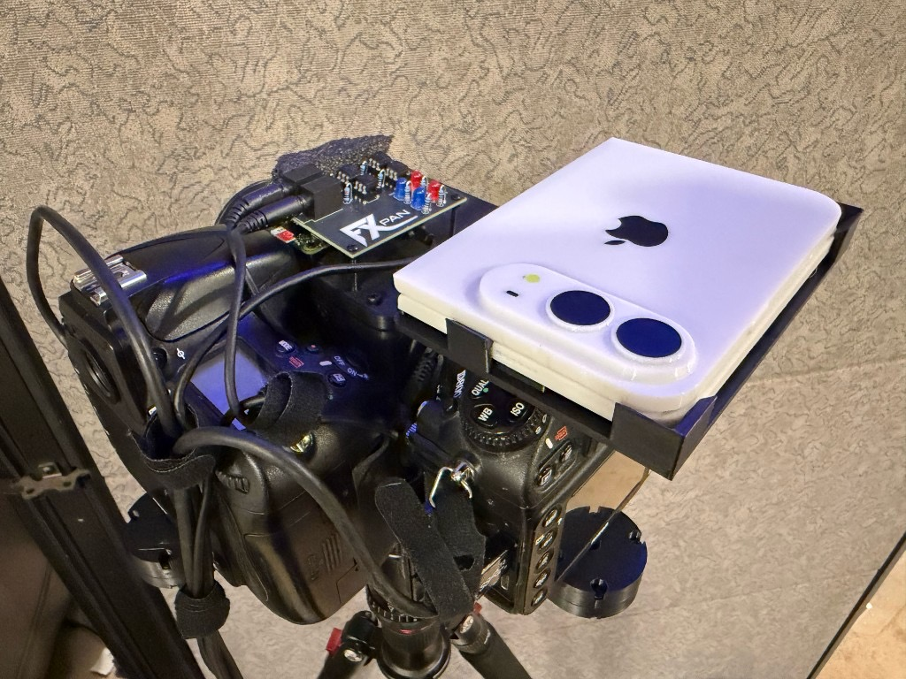

Buy list, print list, and assembly: [bom.md](bom.md).
The model, the measured focus numbers, and the long alignment notes:
[openscad/fxpan/README.md](openscad/fxpan/README.md).

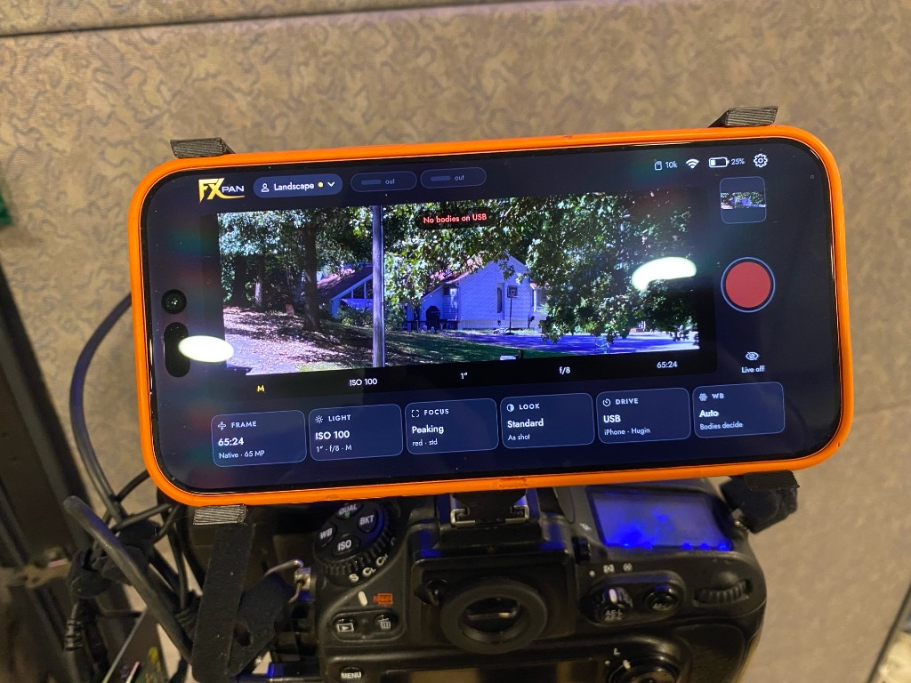

## How it goes together

The plate is in the tray, coating toward the lens, 75 mm across the fold.
The two arms leave the box at a right angle. The base carries both bodies.
The mouths are printed F. The lens is the Nikkor-W.

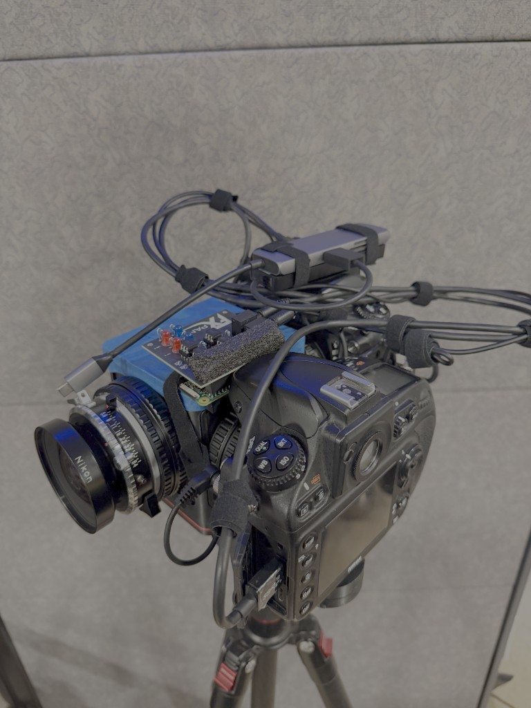

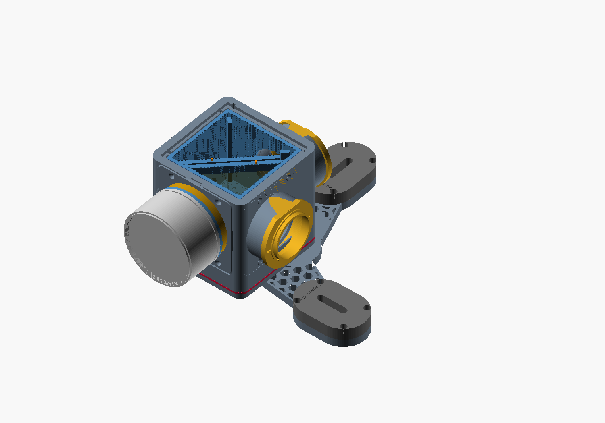

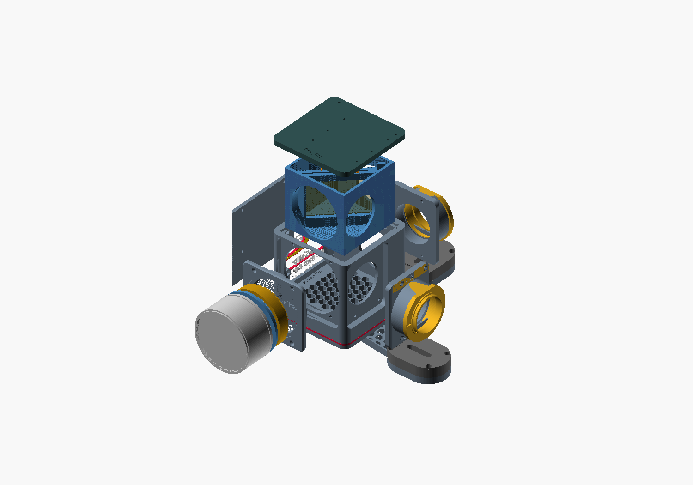

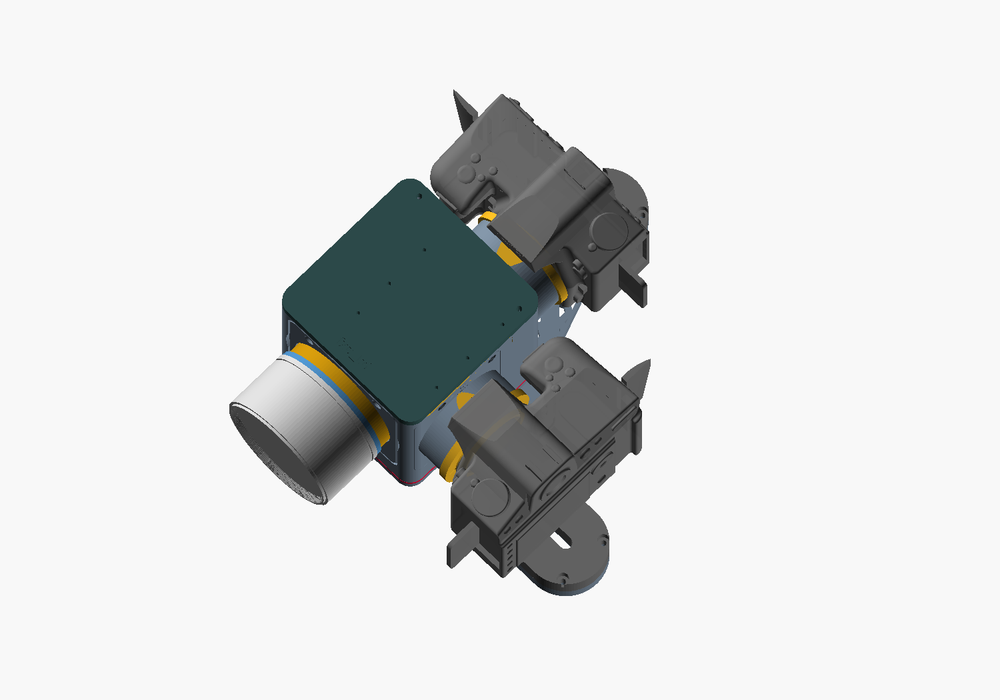

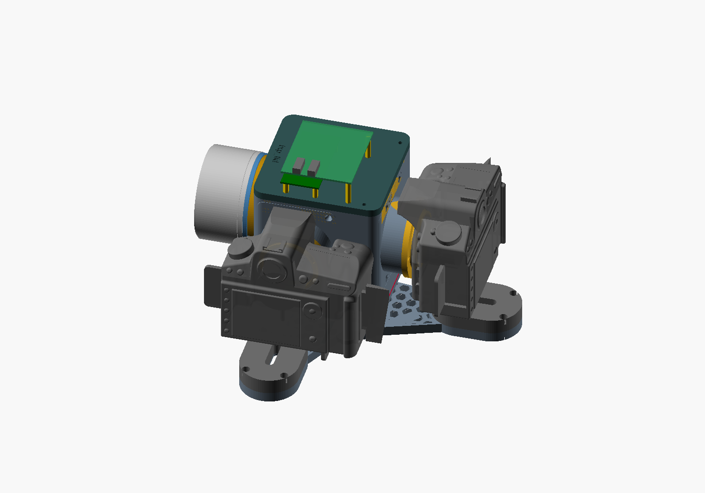

## What the two frames become

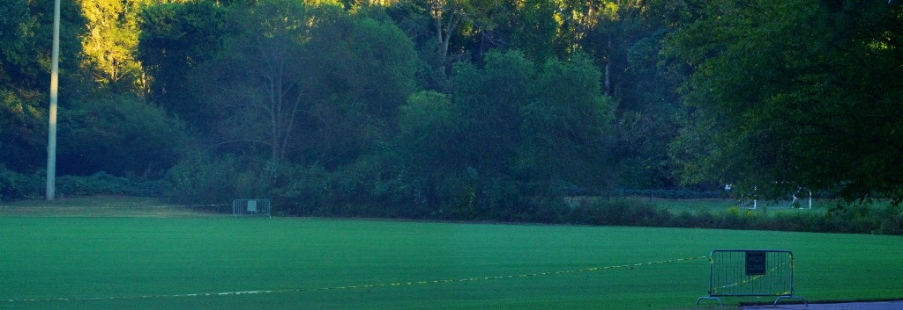

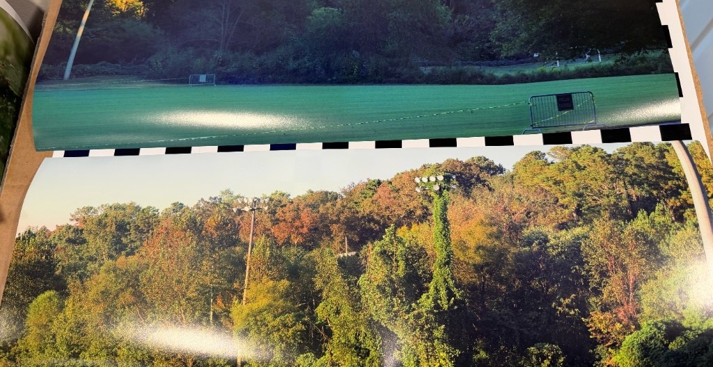

## The ray trace

The plate is 75 mm across the fold. At 45° that presents 53 mm, against the
44 mm the stitch needs at f/5.6.

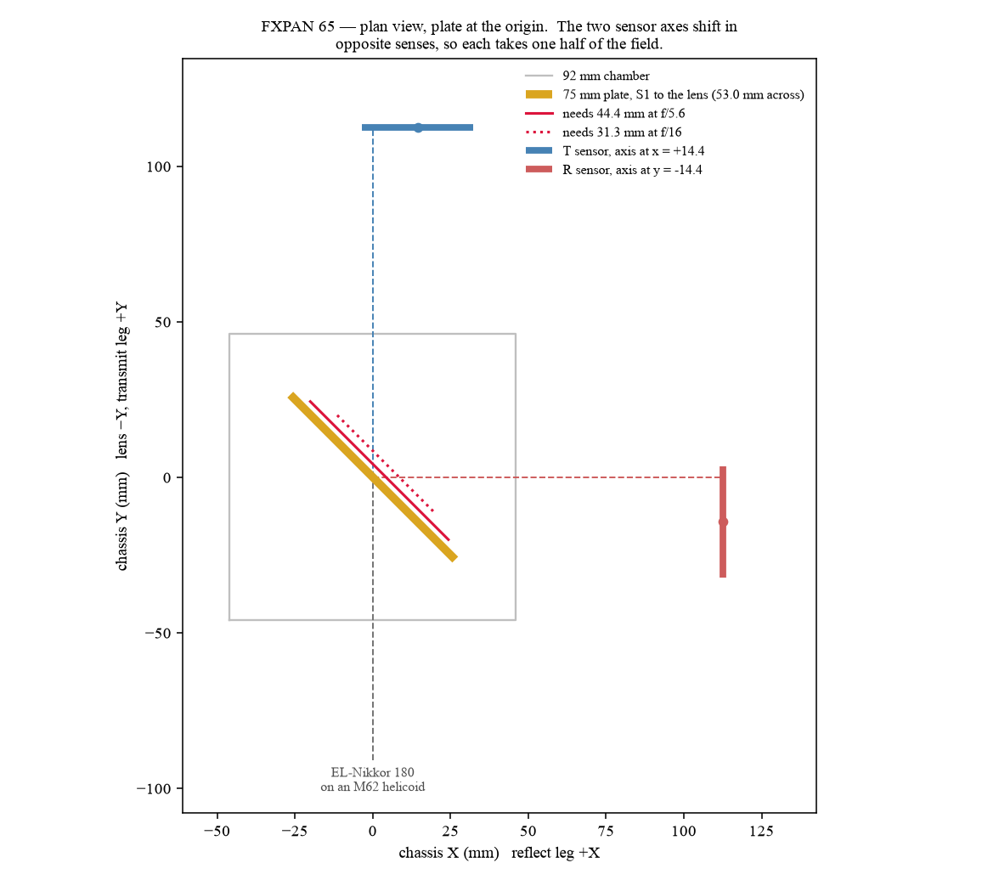

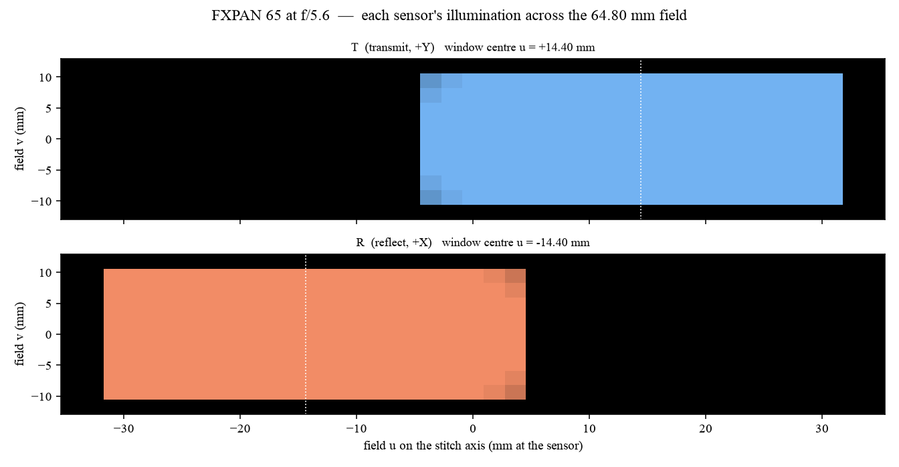

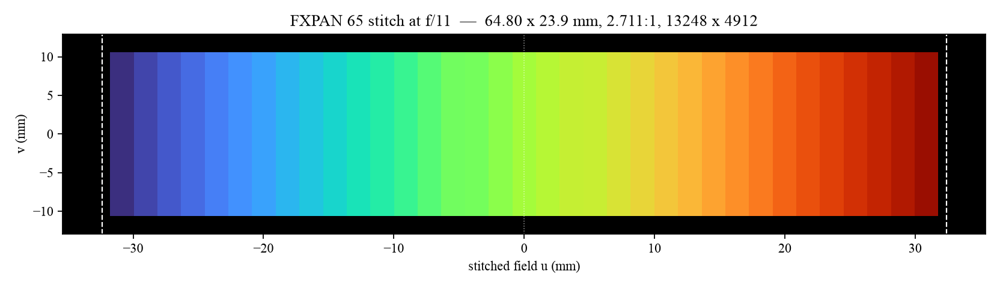

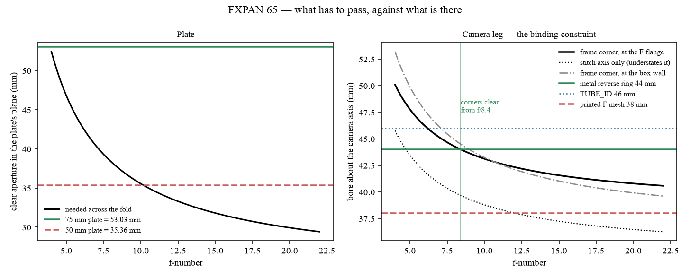

A 2× anamorphic on the front of the 180 is drawn, not fitted on this rig.
Spherical is 20.3° at 50 m. 1.5× is 30.1°. 2× is 39.5°.


```
python kraken/fxpan_paths.py    # exits non-zero if the body and the numbers disagree
python kraken/fxpan_scene.py    # the countryside above
```

## Where the rest went

The D7000 hybrid, the V, the shifted kits, the 5D and α7 forks, and their
export scripts are in [archive/](archive/EARLIER.md). They are not this camera.
