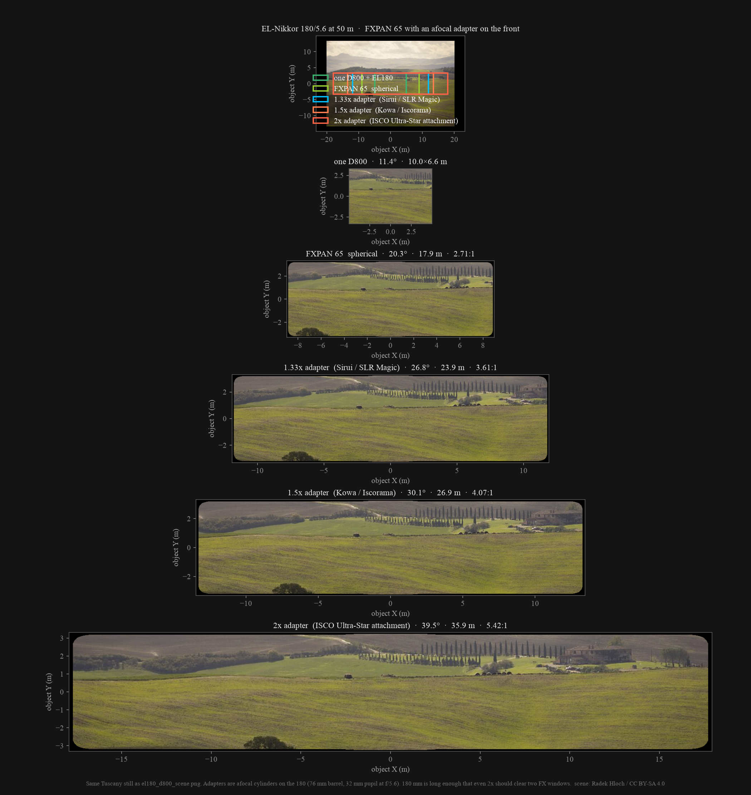
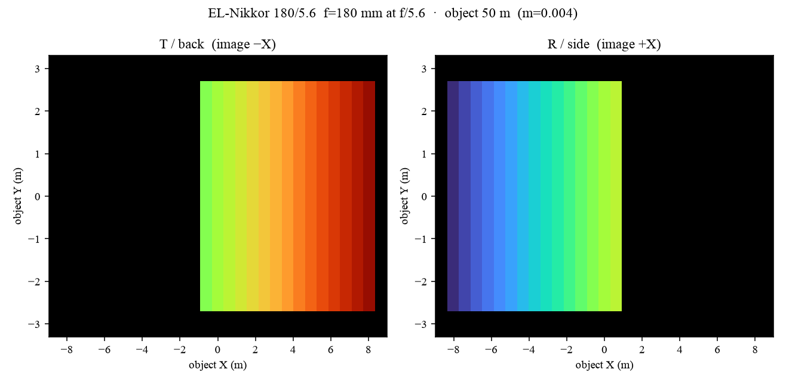
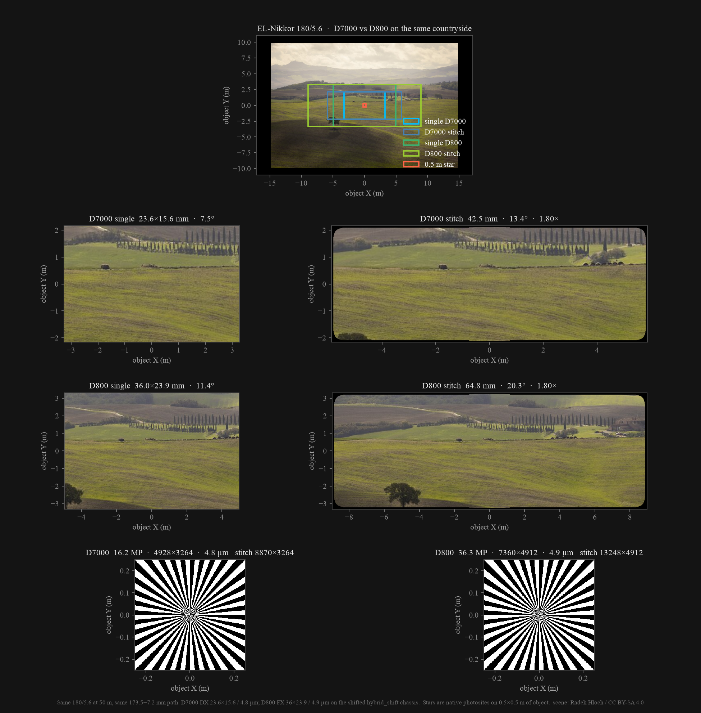

# D12600

One taking lens. Two bodies. A **1.8×** stitch.

Each camera is aimed at a different half of a wider image (20% overlap). The taking lens is an enlarger/LF optic on an M42 helicoid — never a native-mount still lens. Path is `fold + register`. Math: [OPTICS.md](OPTICS.md). Buy list and assembly: [bom.md](bom.md).


Hybrid L — D7000s on **▲ R** (+X) and **▲ T** (+Y), both **upright**. Stem is the EL-Nikkor. Bodies are preview ghosts; the print is the box, tubes, and `brace`. Tripod goes in the brace, not the box.


Lid off: one uncut 50×50×1 plate, S1 toward the lens. Gold mouths are 52×0.75 reverse rings (or print `arm_*_f` for a male bayonet).


The original **V**: two first-surface mirrors, opposite arms, field-split. Same box, same stem.

## Print STLs

Ready to slice. Every fork is a complete kit under [`stls/`](stls/). `arm_*.stl` is the reverse-ring mouth; `arm_*_f.stl` is the printed male bayonet.

| Kit | Bodies | Mouth | Path | 135/5.6 | Stitch | Files |
|-----|--------|-------|------|---------|--------|-------|
| [`stls/hybrid/`](stls/hybrid/) | D7000 DX | 52 mm F | 173.5 mm | ~0.61 m | 42.5 mm · 14° · ~8.9k · **toed** | `--hybrid` |
| [`stls/hybrid_shift/`](stls/hybrid_shift/) | D7000 DX | 52 mm F | 173.5 mm | ~0.61 m | 42.5 mm · **shifted**, no Scheimpflug | `--hybrid-shift` |
| [`stls/hybrid_shift_fx/`](stls/hybrid_shift_fx/) | D800 FX | 52 mm F | 173.5 mm | ~0.61 m | 59.0 mm · **shifted** · ~12.1k | `--hybrid-shift-fx` |
| [`stls/hybrid_shadowgraph/`](stls/hybrid_shadowgraph/) | D7000 DX | 52 mm F | 173.5 mm | ~0.61 m | same frame · T sharp / R shadowgraph | `--shadowgraph` |
| [`stls/EFhybrid/`](stls/EFhybrid/) | 5D Mark III FF | 58 mm EF | 171 mm | ~0.64 m | 64.8 mm · 21.5° · ~10.4k | `--efhybrid` |
| [`stls/Ehybrid/`](stls/Ehybrid/) | Sony α7 FF | 52 mm E | 145 mm | **~2 m** | 64.4 mm · 25° · ~10.8k | `--ehybrid` |
| [`stls/v/`](stls/v/) | D7000 DX | 52 mm F | 173.5 mm | ~0.61 m | 37.8 mm · 12.4° · ~7.9k | `./export_stls.sh` |
| [`stls/bsplit/`](stls/bsplit/) | D7000 DX | 52 mm F | 173.5 mm | — | same frame, −1 stop | `--bsplit` |

**Print:** PETG or ABS (not PLA for bayonets). Box **floor on the bed**. Tubes **flange on the bed**. Bolt each flange with 4× M3 + hex nuts in the wall traps.

### Hybrid kit (`stls/hybrid/`)

| File | What | Bed |
|------|------|-----|
| `chassis.stl` | 90 mm junction box | floor down |
| `hybrid_tray.stl` | 50×50 plate seat + roof pegs | as exported |
| `lid.stl` | chamber lid, blind Pi holes + 4× M3 display bosses | outer face up |
| `display_mount.stl` | bridge over the Pi; AMPS + 48 mm for the Wormfingers case | feet down |
| `stem.stl` | lens tube, M42 helicoid nut (135 / 180) | flange down |
| `stem_f50.stl` | 1.6 mm cookie + female F (50 mm test) | flange down |
| `arm_r.stl` / `arm_t.stl` | 72 mm toed tubes, 52×0.75 (135 / 180) | flange down |
| `arm_r_f.stl` / `arm_t_f.stl` | same 72 mm tubes, printed F | flange down |
| `arm_r_s.stl` / `arm_t_s.stl` | 54 mm F 50 tubes, 2 mm cookies, 52×0.75 | flange down |
| `arm_r_sf.stl` / `arm_t_sf.stl` | same 54 mm tubes, printed F | flange down |
| `shims.stl` | 0.2 / 0.5 / 1.0 mm focus rings | as exported |
| `elnikkor_adapter.stl` | M42 male → L39×26 TPI | M42 male on the bed |
| `brace.stl` | honeycomb triangle under the box + both D7000 1/4-20s (slots); tripod insert at the centroid | floor down |

Do not swap R and T — T is shorter (`bs_t_comp`). Drop the whole Edmund #43-359 plate in from above; do not cut it. Re-export with `./export_stls.sh --hybrid` (wrappers: `./export_hybrid.sh`, `./export_efhybrid.sh`, `./export_ehybrid.sh`).

### Shift kit (`stls/hybrid_shift/`)

Same path, plate, and stitch as hybrid, but the camera tubes are **not toed**. Cookies drop into a rabbet from the lid and two M3s (above/below the tube) follow `sensor_shift()`. Stem stays centered. Lid clamps the plate tops.

The chassis floor can stay PCTG — the cartridge is the dark cup. `*_inner.stl` is the 1.6 mm lining (PETG / CF-PETG) on tubes, F-mount throats, and the lid ceiling; `*_outer.stl` is the rest (PCTG), including the F-bayonet. Load both in the slicer as one object, inner assigned to the dark filament. Bare `chassis.stl` / `arm_*.stl` / `lid.stl` are the single-material solids. Part stamps start with `hs_` so they are not mixed with the toed hybrid kit. Lid off: slide each 90 mm plate down its face, then 2× M3 through the cookie into wall nuts. Export: `./export_stls.sh --hybrid-shift` or `./export_hybrid_shift.sh`.

| File | What | Bed / filament |
|------|------|----------------|
| `chassis.stl` | full 90 mm box | floor down · one material |
| `chassis_inner.stl` / `chassis_outer.stl` | lining / PCTG shell | floor down · PETG + PCTG |
| `stem.stl` + `_inner` / `_outer` | lens tube | flange down |
| `arm_r.stl` / `arm_t.stl` + `_inner` / `_outer` | untilted 72 mm tubes, 90 mm cookies, shifted bore; inner has 45° ID baffles + F-throat glare plate | flange down |
| `lid.stl` + `_inner` / `_outer` | chamber lid; inner = rim + grooved ceiling + display-nut pads (PETG), outer = PCTG cap | outer face up |
| `hybrid_tray.stl` | PETG: 50/50 slot + posts, walls to the lid lip, port windows, sawtooth; paint fuzzy skin on the **inside** | floor down |
| `brace.stl` | honeycomb under the box; holes follow the shifted 1/4-20s | floor down |

### Shift FX kit (`stls/hybrid_shift_fx/`) — D800

Same shift geometry as DX, but FX overlap is **36%** so the unique edges sit at **~11.5 mm** shift (not 14.4 mm) for a **~59.0 mm / 59 MP** stitch — T-east still lights when the 180 leaves f/5.6. Open [`openscad/hybrid_shift/WATCH_ME.scad`](openscad/hybrid_shift/WATCH_ME.scad), set **Camera → FX_MODE = 1** in the customizer to preview D800 ghosts, or export with `./export_hybrid_shift_fx.sh`. FX parts are stamped **FX CHASSIS / FX ARM R / FX ARM T / FX LID / FX BRACE / FX TRAY** (DX keeps `hs_`).

**Print from `hybrid_shift_fx/`:** `chassis` (+ `_inner` / `_outer`), `arm_r` / `arm_t` (+ `_inner` / `_outer` / `_f` variants), `lid` (+ `_inner` / `_outer`), `brace`, `hybrid_tray`. Wall type as separate colors: `chassis_logo_fx` (Nikon FX badge — gold), `chassis_logo_word` (PAN + its XPan underline), `chassis_logo_mp` (59MP), `chassis_logo_rule` (hairline), `chassis_logo_spec` (12070×4912 · 2.46:1). Chassis pocket is all five; load each STL as a part on the chassis and give it a filament. The plugs deliberately overrun the pocket — 0.08 mm into its walls and floor, 0.06 mm proud of the wall — so no face is coplanar with the chassis and the slicer resolves each color cleanly instead of z-fighting the pocket.

**Reuse from `hybrid_shift/`:** `stem`, `shims`, `elnikkor_adapter`, `el180_adapter`, monitor parts, focus tools. Same 52×0.75 F reverse rings and path. The FX tray follows the 11.5 mm bores (port windows + clamp/nut reliefs); do not reuse the DX tray.

**Stitching this kit needs the Overlap slider at 36%.** The app now defaults to **20%** because that is what FXPAN 65 and the DX shift kit want. Match finds the real overlap either way, but the slider seeds the search and Cut/Blend use it directly.

Tune **D800_TRIPOD_ABOVE** / **D800_TRIPOD_IN** in the customizer after measuring your bodies (defaults are estimates).

**Fuzzy skin (Bambu Studio)** — same numbers on every dark PETG light-path wall. Fuzzy only jitters **walls**, not top/bottom. ([Bambu wiki](https://wiki.bambulab.com/en/software/bambu-studio/parameter/fuzzy-skin))

| | |
|--|--|
| Fuzzy Skin | `None (Allow Paint)` |
| Apply fuzzy skin to first layer | off |
| Thickness | `0.3` mm |
| Point distance | `0.8` mm |

Prepare → **Fuzzy Skin painting** (spray next to support painting). Slice and check Preview: jitter on painted perimeters only.

**Cartridge** (`hybrid_tray.stl`, floor on the bed). Do not fuzz the outside (0.4 mm slip into the box). Paint the inner cup walls, the plate-frame cheeks, and the window rim. Skip the outer cup, the glass slot faces, the floor (already hatched), and the lid-fork posts. A cube **modifier** filling the cavity with Fuzzy Skin = `All walls` also works; keep it inside the cup so it does not touch the outer skin.

**Tube / box liners** (`arm_*_inner.stl`, `stem_inner.stl`, `chassis_inner.stl`, cookie on the bed). Paint the **bore** (baffle teeth and the glare-plate rim). Skip the cookie OD, the clamp pads, and anything that mates to PCTG. Do not paint `*_outer` or the gold F-bayonet — those stay smooth. The glare plate sits in the F throat on the chassis side of the register; it does not enter the mirror box.

### FXPAN 65 (`stls/fxpan/`) — D800, clean sheet

A separate body, not a variant. Two D800s behind one EL-Nikkor 180/5.6 and a **50 × 75 × 1 mm** 50/50 plate, stitching **64.80 × 23.9 mm · 2.711:1 · 13248 × 4912 · 65.1 MP** — XPan is 65 × 24 and 2.708:1. **True infinity**, and corner-to-corner clean from **f/8.4** down to f/22.

The shift kits above retreat to 36% overlap because a 50 mm plate at 45° only presents 35.36 mm across the fold and the frame needs 44.4 mm there at f/5.6. FXPAN puts **75 mm across the fold** (53.03 mm presented, +19.5%) and opens the bore to 46 mm with a 44 mm mouth so a 20% overlap and a 14.4 mm shift actually pass. The plate is deliberately not square: along the fold nothing is foreshortened and only the 23.9 mm sensor height is in play, so 50 mm is +72% there — and that direction sets chassis height, so the rectangle is 25 mm shorter for free. Nothing is interchangeable with the shift kits — every part is stamped `fxp_`.

The F register stands 16 mm off the chassis face, because a D800's front panel reaches about 13 mm past its own flange and has to come in and twist to lock — `D800_PROUD` is what sets the arm tube length and therefore the chassis. Print `ringgauge` before anything else and set `F_REV_CLEAR` from it: the M52 mouths on the older arms never took a reverse ring, and the fix (a truncated thread crest instead of a sharp full-height V) is new enough here to be worth checking on your own printer. The two M3 grubs that lock each ring now sit in lugs *outboard* of that thread rather than in pockets cut through it, at 135° and 225° from camera-up where the wall is not raked back for the pentaprism. Drop their nuts in from the mouth end before the ring goes on.

A port cookie's face is the outside of the camera here, since there is no wall over it, so each one is drawn to vanish into the chassis: R6 corners, a 1.2 mm chamfer round the outer edge, and the outer face clipped to the chassis's own R9 plan profile where it curves away underneath. They are also sized off their own features rather than the face they sit on — **77.8 × 62 for an arm, 77.8 × 74 for the stem**, 36.6% less plate than the 90 mm squares they replace. All of that is on the top face; the cookies print flange-down with the arm up and the bed face is the full flat plate. Their rebates are blind pockets closed on all four sides, so the chassis keeps an unbroken top rim and the lid sits flush on it.

Open [`openscad/fxpan/WATCH_ME.scad`](openscad/fxpan/WATCH_ME.scad) and read the console; it echoes the whole path budget with margins and marks anything that clips. Export with `./export_fxpan.sh` (35 STLs). Ray-trace check: `python kraken/fxpan_paths.py` — it exits non-zero if the geometry stops matching the numbers, and writes [`docs/kraken/fxpan_margins.png`](docs/kraken/fxpan_margins.png). Print list, assembly and alignment: [`openscad/fxpan/README.md`](openscad/fxpan/README.md). Derivations and the numbers you must not move: [`openscad/fxpan/PLAN.md`](openscad/fxpan/PLAN.md). Buy list: [`openscad/fxpan/bom.md`](openscad/fxpan/bom.md).

Three caveats up front. It is a **20.4° horizontal** field — XPan's aspect, not XPan's angle of view. The working aperture is **f/8 to f/22**: at f/5.6 the frame corners drop to 0.84 while the long axis stays clean, because the 44 mm Nikon F throat is a hard ceiling and a 14.4 mm shift spends nearly all the margin it ever had. And the **metal 52 mm F reverse rings are not optional** — the printed bayonet mesh is 38 mm clear against the 38.47 mm the corners need at *any* f-number, so it never passes the whole frame.

An afocal anamorphic **adapter** on the front of the 180 is the optic that actually belongs here — a cylinder that squeezes a wider object into the same 64.80 mm stitch. 180 mm is long enough that even 2× should clear both FX windows (photo 2× attachments vignette below ~85 mm on full frame). The EL-Nikkor's rear is M62 into the helicoid; the barrel is 76 mm OD, so the adapter clamps onto that, it does not step-ring onto a filter thread. Same Tuscany still as the D800 180 countryside below: one D800 is **11.4° / 10.0 m**; FXPAN spherical is **20.3° / 17.9 m / 2.71:1**; 1.33× is **26.8° / 23.9 m / 3.61:1**; 1.5× is **30.1° / 26.9 m / 4.07:1**; 2× is **39.5° / 35.9 m / 5.42:1**. 1.5× is the stills pick (6×17 / 6×24 territory). 2× is cinema. The ISCO Ultra-Star HD Plus **60 mm integrated** projector lens (stock 748.50.06) is the wrong class: 60 mm f/2.1, BFL 36 mm, 21.3×18.2 mm Scope gate — it cannot cover two D800s and it is not a front adapter.



```
kraken/.venv/bin/python kraken/fxpan_scene.py   # countryside: spherical vs 1.33 / 1.5 / 2×
```

### Shadowgraph kit (`stls/hybrid_shadowgraph/`)

Same box, stem, tray, and lid as hybrid. Tubes are not toed — both bodies see one frame. `arm_t` is the conjugate tube (`▲ T shadowgraph`). `arm_r` is the longer razor-slot tube (`▲ R shadowgraph`). Do not stack a 0.6 mm ring to fake it. Export: `./export_stls.sh --shadowgraph` or `./export_shadowgraph.sh`. Sims, what it can do, and the bench setup: [Shadowgraph](#shadowgraph).

## Light path

The hybrid L is **one** 50/50 plate, not a knife in the pupil. Lens on −Y. Reflect → R (+X). Transmit → T (+Y). Each arm is toed by `field_toe` so its sensor window sits on a different half of a `stitch_w` image. Both bodies sit upright. `brace` takes the weight from below (box 1/4-20 + slotted body 1/4-20s); the tripod heat-set is at the triangle centroid.


KrakenOS sequential fold. Plate at z = 55 mm. Gold = 50/50. Red = R sensor. Blue = T sensor. Same fold on every hybrid kit; only the register (46.5 / 44 / 18 mm) changes `PATH_TOTAL`.


Non-sequential trace **on the print meshes** (`stls/hybrid/chassis.stl` + `hybrid_tray.stl`). Plastic is absorb. Blue = T through the slot. Red = R off the coating. Left is top (lens −Y, T +Y, R +X). The plate is large enough — the field at the glass is small.


Same idea on the V (`stls/v/chassis.stl` + `mirror_tray.stl`). Two 45° first-surface mirrors, knife at the origin. Blue = L (−X). Red = R (+X). Incoming from the lens (−Y). Unique halves stay full brightness.

On a D7000 + EL-Nikkor 135/5.6: focus **~608 mm**, stitch **~149 mm** of object / **42.5 mm** on the sensors, **~14°**, **~8870×3264**. T-only / overlap / R-only = 108 / 27 / 108. The **180/5.6** at 50 m (helicoid **+7.2 mm**, path **180.7 mm**) is the same angular stitch on a **~12 m** field. `ratio` must stay ≥ 1.6. Full budget: [OPTICS.md](OPTICS.md).

Regenerate:

```
kraken/.venv/bin/python kraken/hybrid_paths.py       # fold + frames + stitch
kraken/.venv/bin/python kraken/hybrid_stl_paths.py   # rays on the hybrid STLs
kraken/.venv/bin/python kraken/v_stl_paths.py        # rays on the V STLs
kraken/.venv/bin/python kraken/hybrid_scene.py       # countryside below
```

## Field — same countryside, three bodies

Same Tuscany still through the toed windows. Scene: [Radek Hloch / CC BY-SA 4.0](https://commons.wikimedia.org/wiki/File:Landscape_of_Tuscany_3.jpg).

D7000 / 5D III: 135 focuses **~0.61–0.64 m**. α7: E is 18 mm, so the same lens focuses at **~2 m** and the object field is much larger. That is the chassis, not a different lens. Landscape on this box is the **180/5.6** at **50 m** (the 135 cannot get there).

### D7000 DX — 173.5 mm, ~0.61 m

One DX window (~83×55 mm, 7.8°) vs the stitch (~149 mm, 14°, ~8870×3264).


T and R each own a half. Color map of that split, and the stitched strip:


Same DX window, D7000 (16.2 MP, 4.8 µm) vs D7200 (24.2 MP, 3.9 µm). Stars are native photosites on 8×8 mm of object.


### V knife — same 173.5 mm, ~0.61 m

Hard field split. Each D7000 still records a full DX frame, but the frame is one half of the taking-lens image plus **20% across the knife** (~4.7 mm / ~1000 px). Unique halves keep a stop. Stitch is **1.6×** (~133 mm of object, 12.4°, ~7885×3264).


Same still, V vs hybrid L. Hybrid is two toed full-frame windows on a 50/50 (1.8×, −1 stop). The V boxes sit inside the hybrid stitch.


### 5D Mark III FF — 171 mm, ~0.64 m

36×24 mm, 6.25 µm. Single ~135×90 mm / 12°. Stitch ~243 mm / 21.5° / ~10368×3840.


### Sony α7 FF — 145 mm, ~2 m

35.8×23.9 mm, 6.0 µm. Single ~483×323 mm / 14.1°. Stitch ~870 mm / 25.1° / ~10800×4000.


D7000 at 0.61 m is a postage stamp on the α7 field.


### D7000 DX — EL-Nikkor 180, 50 m

Infinity helicoid (**+7.2 mm**, path **180.7 mm**). Same Tuscany still as a distant landscape. One DX is **~6.5×4.3 m / 7.5°**; stitch is **~11.8 m / 13.4° / ~8870×3264** (1.8×). Angular FOV is almost the 135 at 0.61 m; the object is **~12 m**, not 15 cm. 135 cannot focus here. T-only / overlap / R-only = 108 / 27 / 108. `ratio` 1.67.


Same DX window, D7000 vs D7200. Stars are native photosites on **0.5 m** of object (8 mm is invisible at 50 m).


### D800 FX — EL-Nikkor 180, 50 m (`hybrid_shift` FX_MODE)

Same path (**+7.2 mm** helicoid, **180.7 mm**). Shift **11.5 mm**, stitch **59.0 mm**. One FX is **~10.0×6.6 m / 11.4°**; stitch is **~15.2 m / 17.2° / ~12070×4912** (1.64×). Overlap 36%.







## Shadowgraph

The pano hybrid toes each body at a **different** half of a wider image. For air, vapor, or a shock you want the **same** DX pixels (`field_toe = 0`). That is [`stls/hybrid_shadowgraph/`](stls/hybrid_shadowgraph/): same box, same uncut #43-359 plate, same 135/5.6. Different tubes.

T is conjugate — a phase-blind image of the card (the slug only). R is **0.6 mm** longer, about **7.4 mm** of object-side defocus (`extra / m²`). Ray bunching at a density jump is the shadowgraph. Both flanges say **shadowgraph**. Do not swap them. Do not stitch.


Top: current hybrid (~4.6° toe). Subtract T−R and you have two scenes — a tree that only exists on one body looks like flow. Bottom: shadowgraph arms (`toe = 0`). Same pixels. The knife panel is Kraken’s ray walk through a jet, linearized.


Same 50/50 pair, M≈2. T is the silhouette. R is the printed extra length at DX sampling. Right is a collimated-lab Settles plate — the thing this chassis is not.


Same Kraken OPD. Geometric extra ≈ Fresnel at the chassis z (7.4 mm) — a printed phase plate does not buy a Mach cone. A Fourier knife is schlieren. A 250 mm lab throw is closer to Settles and is a **different illuminator**, not a printed part. Do not add a Zernike / phase plate.


Background-oriented schlieren on `toe = 0`: speckle card, both bodies see this. Correlate each body against its own still. Quiver is Kraken’s chief-ray walk. Stitch first and the hybrid toe looks like fake flow.

### Setup

1. Print the shadowgraph kit. Box floor on the bed; tubes flange on the bed. Same plate drop as hybrid: **S1 toward the lens**.
2. Bright card (or a speckle card for BOS) at **~0.61 m** — the 135 conjugate on `PATH_TOTAL = 173.5`.
3. Helicoid until **T** is sharp on the card. Leave R alone. The extra length is the tube, not a stacked ring.
4. Put the subject in front of the card (jet, wake, slug). MC-DC2 Y-lead — USB fire is tens of ms apart.
5. Optional: a razor in the R mouth slot (0.42 mm, +Y through to the axis). Soft Fourier cutoff, ~8 mm early of the 135 rear focus; the real plane sits ~8 mm *inside* the F-mount.
6. Compare T vs R on the same pixels. Do not stitch. Do not subtract a toed pano pair.

### What this chassis will and will not do

| Works | Will not |
|-------|----------|
| Geometric shadowgraph on R (printed +0.6 mm) | Settles spark *lines* from chassis z — that needs ~250 mm of throw and a collimated flash |
| Same-image BOS on a speckle card | Using the pano hybrid and subtracting — two windows, looks like flow |
| Razor in the R slot (soft knife / weak schlieren) | A printed Zernike or phase plate — helps weak phase, not a Mach cone |
| Heat-gun / shock / vapor in front of the card | Stereo, or a field-split V, of the same event — one taking lens |

Regenerate:

```
kraken/.venv/bin/python kraken/schlieren_scene.py      # toe vs same-image, BOS, ray walk
kraken/.venv/bin/python kraken/shadowgraph_scene.py    # T slug / R cone / Settles
kraken/.venv/bin/python kraken/shadowgraph_wave.py     # Fresnel / knife / phase plate
```

## Dual D7000 USB

Nikon-only. Both bodies: Setup → USB → **MTP/PTP**. Pair T/R serials once; the kiosk claims those bodies on boot and fills the HUD. The taking-lens iris is the enlarger ring. A CPU/G glass on the F-mount can take PTP **f/** (mode dial **A** or **M**). `gphoto2` is already the Mac driver.

```
python3 cam/dual.py detect
python3 cam/dual.py pair --t SERIAL --r SERIAL
python3 cam/dual.py set --iso 400 --shutter 1/125 --fstop 5.6 --program M
python3 cam/dual.py shoot captures/
```

ISO, shutter, and f/ write to **both** bodies. FIRE drops live view, forces ISO Auto off, then sets exposure in the same gphoto2 process as the still. USB fire is tens of ms apart — MC-DC2 Y-lead for anything that moves.

SET stores **GPIO shutter** (BCM 21 / Corona / Y-lead), **Download files**, overlap, flop R, and **Preview** seconds (last stills on LIVE after a download). Defaults for download/GPIO are on on a Pi and survive restarts. USB **Sim as Pi** lets a Mac show the GPIO switch (no pulse).

```
python3 cam/web.py          # iPhone: http://<lan-ip>:8787/   laptop: http://127.0.0.1:8787/lab
```

On the 10.1″ Pi (`airdamien@192.0.2.10`) the field page is **D12600**: Chromium kiosk, login autostart, respawn loop. SET **Desktop** returns to labwc. Tap **D12600** on the desktop to come back. Deploy: `./scripts/redeploy-kiosk.sh`.

Tabs are **LIVE / USB / PANO / FILES / SET**. LIVE is home. The side stack is START, **PREVIEW**, ISO, FIRE. PREVIEW stitches T/R with the SET overlap/flop — live frames if START is on, otherwise the last pair in `captures/`. ISO is a modal (ISO / shutter / f/). APPLY and FIRE re-read the bodies into the HUD.

SET is grouped: **Exposure** (ISO / shutter / f/ / program / WB / quality + APPLY), **Master** (T or R), **Capture** (download, GPIO, flop R, overlap, preview seconds), **Screen** (HDMI DDC backlight), **Wi-Fi** (scan / join, AP `D12600`), **Pi** (Sim as Pi, Desktop).

PANO **STITCH** queues on a background worker so you can keep shooting. Modes are match / blend / cut / open (OpenStitching). Each pair card keeps QUEUED / WORKING / OK / ERROR. Newest shots sit at the top. A pair needs T and R JPEGs; T-only until the splitter is in will say so on that card. FILES is the same list.


```
./scripts/setup-pi-remote.sh airdamien@192.0.2.10
./scripts/redeploy-kiosk.sh                  # rsync cam/ + restart web.py + Chromium
```

## Source

1. Open the watch file for the fork you are printing.
2. Enable **Design → Automatic Reload and Preview**.
3. Tweak that folder’s `params.scad`. `ARM_MOUNT=0` is the reverse-ring mouth; `1` is the printed male bayonet.

```
python3.12 -m venv kraken/.venv
kraken/.venv/bin/pip install -r kraken/requirements.txt
```

`docs/kraken/`, `docs/chassis/`, and `docs/cam/` are committed. `kraken/preview_*.png` is gitignored.

| Path | Role |
|------|------|
| `stls/{v,bsplit,hybrid,hybrid_shift,hybrid_shadowgraph,EFhybrid,Ehybrid}/` | Print STLs |
| `openscad/WATCH_ME.scad` | V |
| `openscad/hybrid/WATCH_ME.scad` | D7000 hybrid L (toed) |
| `openscad/hybrid_shift/WATCH_ME.scad` | D7000 hybrid L (shifted, no Scheimpflug) |
| `openscad/hybrid_shadowgraph/WATCH_ME.scad` | same-image T sharp / R shadowgraph |
| `openscad/EFhybrid/WATCH_ME.scad` | 5D Mark III |
| `openscad/Ehybrid/WATCH_ME.scad` | α7 |
| `openscad/monitor/WATCH_ME.scad` | HAMTYSAN 10.1″ HCIK101V.CC ghost |
| `kraken/hybrid_paths.py` | Fold + frames + stitch |
| `kraken/hybrid_stl_paths.py` | Rays on the hybrid STLs |
| `kraken/v_stl_paths.py` | Rays on the V STLs |
| `kraken/hybrid_scene.py` | Countryside |
| `kraken/schlieren_scene.py` | Toe vs same-image, BOS, ray walk |
| `kraken/shadowgraph_scene.py` | T slug / R cone |
| `kraken/shadowgraph_wave.py` | Fresnel / knife / phase plate |
| `OPTICS.md` / `bom.md` | Path math + buy + assembly |
| `docs/monitor/` | 10.1″ panel datasheets / sibling drawings |
| `cam/dual.py` | D7000 USB (gphoto2 PTP) + master→slave copy |
| `cam/wifi.py` | nmcli scan / join / AP |
| `cam/brightness.py` | HDMI DDC/CI backlight (VCP 0x10) |
| `cam/pano.py` | T/R pairs, stitch queue, OpenStitching |
| `cam/gpio.py` | Pi BCM 21 / Corona Y-lead pulse |
| `cam/kiosk/` | labwc Chromium kiosk, OpenStitching venv, PTP quiet |
