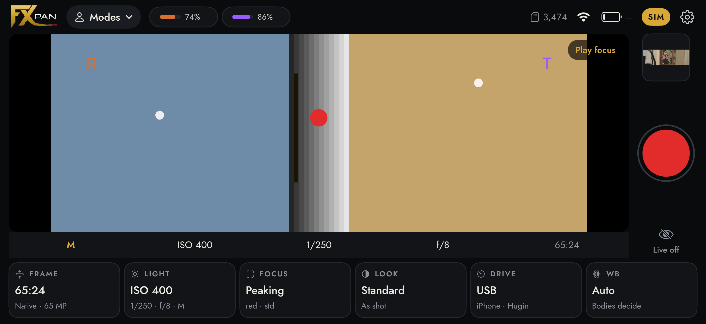
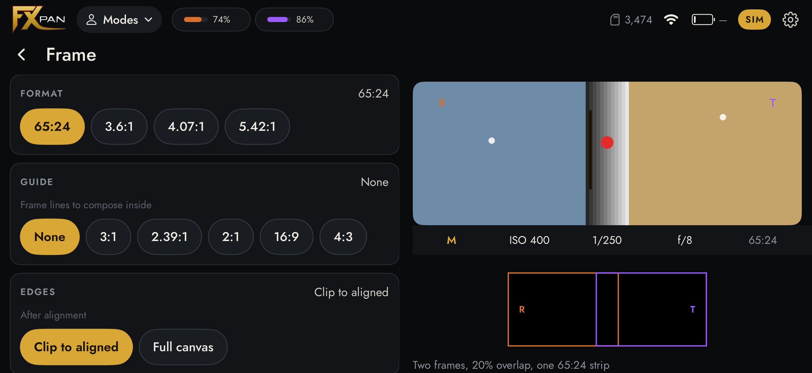
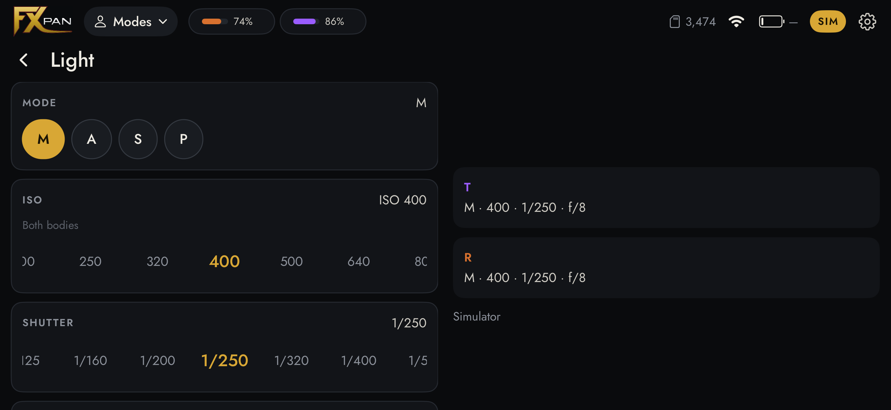
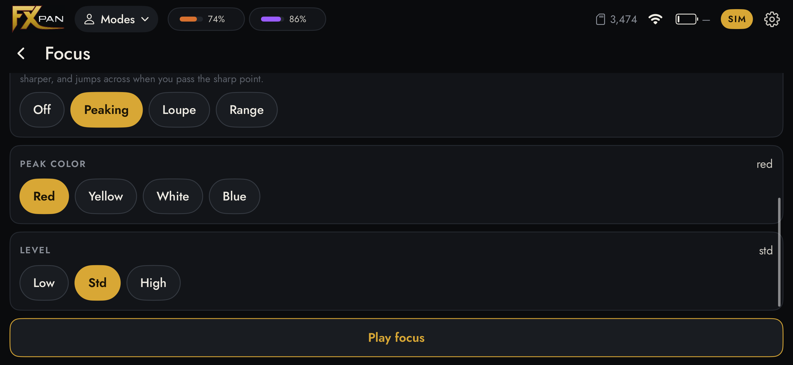
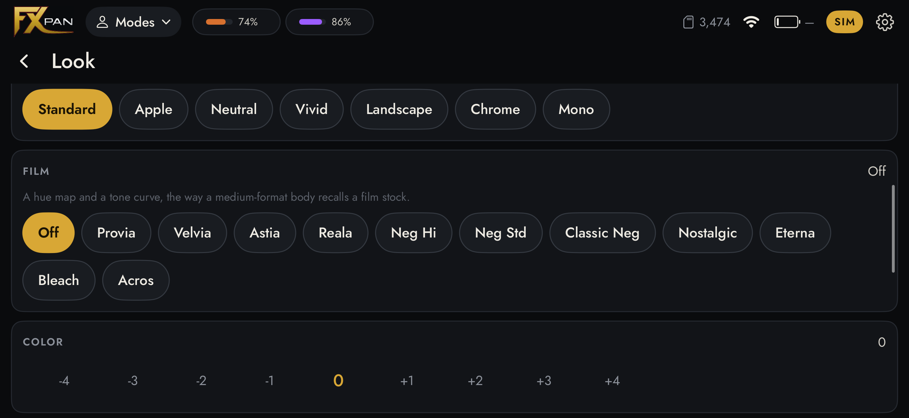
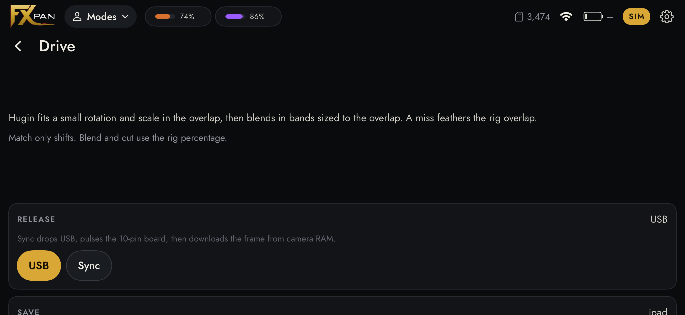
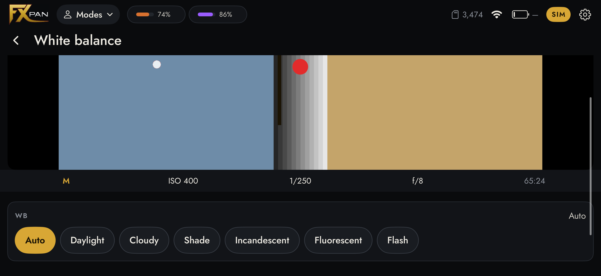
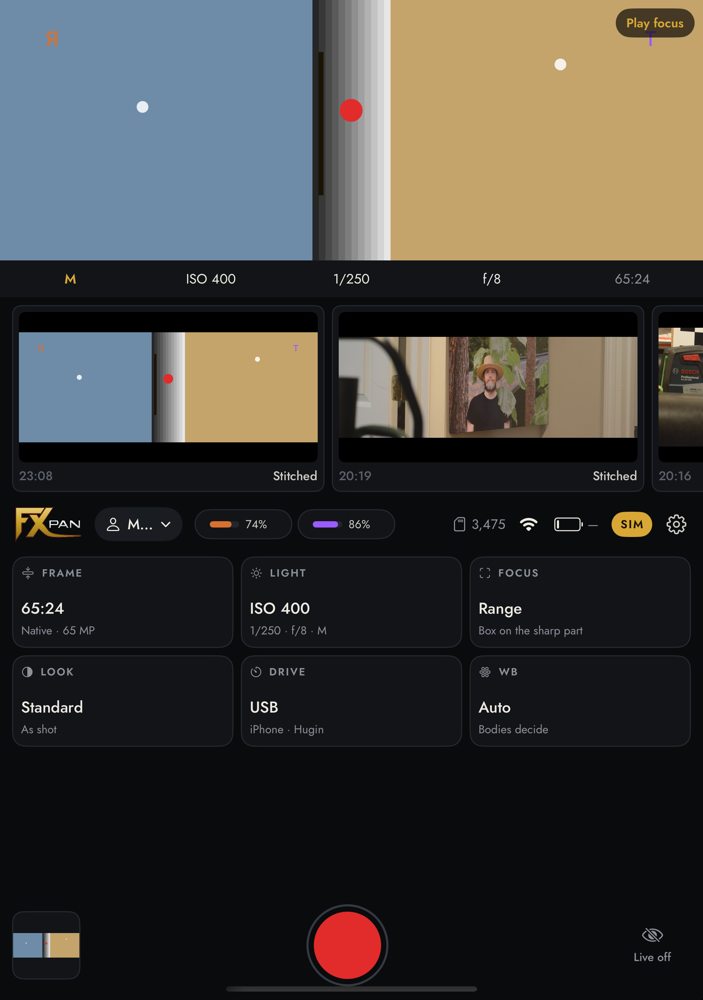

# FXPAN

Two Nikon D800 bodies behind one Nikkor-W 180 mm f/5.6. A 50 × 75 mm
beamsplitter sends each body half of the field. The stitch is

**64.80 × 23.9 mm · 2.711:1 · 13248 × 4912 · 65.1 MP**

XPan is 65 × 24 mm at 2.708:1. It is shot from f/5.6 to f/22. The
Nikkor-W covers the stitch wide open. The 44 mm mouths fully clear the
extreme corners from f/8.4; at f/5.6 those corners still pass most of the
light, and the long axis stays clean. The iPhone is the viewfinder and the
stitcher, and it can release both bodies over USB. A Pi Zero and the trigger
board are optional. They pulse both 10-pin remotes together.


Buy list, print list, and assembly: [bom.md](bom.md).
The model, the measured focus numbers, and the long alignment notes:
[openscad/fxpan/README.md](openscad/fxpan/README.md).


## On the phone

Landscape on an iPhone 17 Pro Max, in simulate mode.















Partly folded on an iPhone Duo. The picture and the last shots stay above the hinge. The controls and the shutter sit below it.



## A Canon, as a try

System has a Canon switch. It stays off until you turn it on. One body, not the pair, and not the stitch.

The camera's USB connection is photo import / remote control. Live view, the shutter, and the copy use that body. The JPEG shows in the roll. A CR3 is saved beside it. The file stays on the card. Turn the switch off and the Nikon pair is back.

## How it goes together

The plate is in the tray, coating toward the lens, 75 mm across the fold.
The two arms leave the box at a right angle. The base carries both bodies.
The mouths are printed F. The lens is the Nikkor-W.


The board is optional. USB release fires both bodies and brings the frames back. The board is the 10-pin path: blue is focus, red is shutter, one pair for each body.


## What the two frames become


## The ray trace

The plate is 75 mm across the fold. At 45° that presents 53 mm, against the
44 mm the stitch needs at f/5.6.


A 2× anamorphic on the front of the 180 is drawn, not fitted on this rig.
Spherical is 20.3° at 50 m. 1.5× is 30.1°. 2× is 39.5°.


```
python kraken/fxpan_paths.py    # exits non-zero if the body and the numbers disagree
python kraken/fxpan_scene.py    # the countryside above
```

## Where the rest went

The D7000 hybrid, the V, the shifted kits, the 5D and α7 forks, and their
export scripts are in [archive/](archive/EARLIER.md). They are not this camera.

## Credits

The D800s in the assembly pictures are mariusimv's approximate model,
[Thingiverse #4815092](https://www.thingiverse.com/thing:4815092).

The printed F mouths start from Archive-663's Nikon mount,
[CC BY-NC-SA 4.0](https://github.com/Archive-663/lensMounts).

The metric threads are Ryan A. Colyer's `threads.scad`,
[CC0](https://www.thingiverse.com/thing:1686322).

The earlier D7000 ghost and the stand-in lens barrel are José Pedro's
Nikon DSLR,
[Printables #1733741](https://www.printables.com/model/1733741-nikon-dslr-camera-model-3d-printable),
CC BY-NC-SA 4.0.

The monitor case is Wormfingers' HAMTYSAN 10.1 enclosure,
[Printables #1041827](https://www.printables.com/model/1041827-hamtysan-101-touchscreen-enclosure),
CC BY 4.0.

The Pi 4 in those older pictures is a Printables mesh, lined up to
[Raspberry Pi's mechanical drawing](https://datasheets.raspberrypi.com/rpi4/raspberry-pi-4-mechanical-drawing.pdf).

The countryside in the anamorphic figure is
[Radek Hloch, CC BY-SA 4.0](https://commons.wikimedia.org/wiki/File:Landscape_of_Tuscany_3.jpg).

The app is set in Jost, SIL Open Font License 1.1,
[The Jost Project Authors](https://github.com/indestructible-type/Jost).
