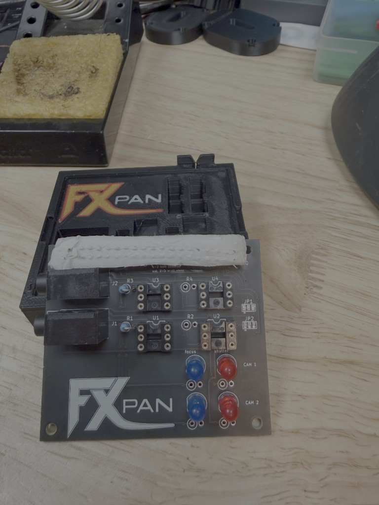

# Board assembly

## Files

| File | Purpose |
|------|---------|
| [schematic.svg](schematic.svg) | Full electrical schematic |
| [layout-perf.svg](layout-perf.svg) | Perfboard + Hammond 1591TBK placement |
| [layout-pcb.svg](layout-pcb.svg) | PCB: both jacks on the pin-1 end, socket on the bottom |
| [netlist.csv](netlist.csv) | Connection list for wiring / KiCad |
| [kicad/](kicad/) | KiCad schematic + placed footprints |

Regenerate everything: `python3 gen_cad.py`

## PCB



The KiCad board is routed and stays inside the Raspberry Pi 4 outline. Both TRS jacks face out the **pin-1** end, away from Ethernet, with the plug mouth at that edge so a chassis wall can meet them. The right edge stops short of the USB and Ethernet jacks. Four 2.7 mm holes (H1–H4) match the Pi’s M2.5 standoffs. Solder the 2×20 female socket on the **bottom**. Pin 1 (square pad) meets Pi pin 1. Gerbers are in `fab/pcbway/`.

JP1 (focus) and JP2 (shutter) ship with pads 1–2 bridged, so both cameras follow pin 38 and pin 40. To drive camera B on its own pins, cut that bridge and solder pad 2 to pad 3. J1 stays on pin 38 / pin 40.

## Perfboard build (alternate)

1. **Board:** 50×70 mm veroboard, 2.54 mm pitch ([BOM](bom.md)).
2. **Enclosure:** drill one **6 mm** hole on each side wall — **J1** plug exits the right side, **J2** the left side (see `layout-perf.svg`).
3. **Mount** perfboard on standoffs; jacks on panel, wired to board edge.
4. **Orientation:** Input (resistors + LED side of 4N35) faces **left** toward Pi harness; output (transistor side) faces **right** toward jacks.
5. **Solder order:** jacks and 4N35 sockets first, resistors, then bus wires (focus, shutter, GND).

## 4N35 orientation

```
      ┌─────────┐
  1 ──┤ ●     ● ├── 6  (collector, tie to 5 or use 5 only)
  2 ──┤       ● ├── 5  → ring or tip
  3 ──┤       ● ├── 4  → sleeve (per jack)
      └─────────┘
   cathode ↑ anode
```

Pin 1 faces **left** (toward resistors) on the layout drawing.

## Pi connection

The PCB uses a **2×20 female socket** and plugs onto the Pi's 40-pin GPIO header.

| Pi physical pin | BCM | Net |
|-----------------|-----|-----|
| 35 | 19 | J2 shutter, only if JP2 pad 2–3 is bridged |
| 37 | 26 | J2 focus, only if JP1 pad 2–3 is bridged |
| 38 | 20 | FOCUS (J1, and J2 while JP1 pads 1–2 are bridged) |
| 39 | — | GND (opto LED cathodes and optional indicator LEDs only) |
| 40 | 21 | SHUTTER (J1, and J2 while JP2 pads 1–2 are bridged) |

Pin 1 of the socket is the square pad and must meet pin 1 on the Pi.

## Optional trigger LEDs

Four 5 mm LEDs, each with its own 330 Ω, on the **Pi side** of the optos. **D1** / **R5** is camera 1 focus (pin 38). **D2** / **R6** is camera 1 shutter (pin 40). **D3** / **R7** is camera 2 focus and **D4** / **R8** is camera 2 shutter: they follow pin 38/40 while the jumpers are bridged, and pin 37/35 after you cut and bridge 2–3. Marked DNP in the schematic. Leave an LED and its resistor off together to omit that lamp. Do not put these LEDs on the camera side of the 4N35.

## Test

```bash
python3 gpio_seq.py --hold-focus   # meter: ring→sleeve on both jacks
python3 gpio_seq.py                # full sequence
```
